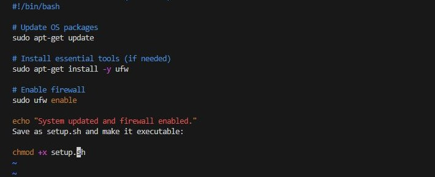
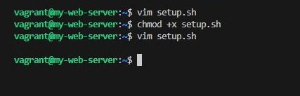
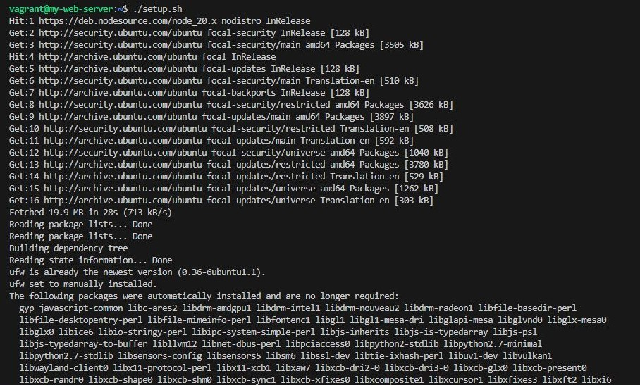
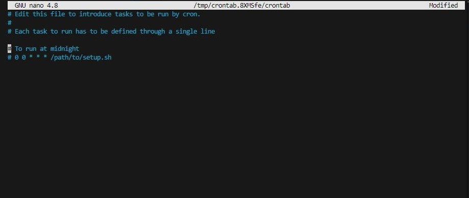
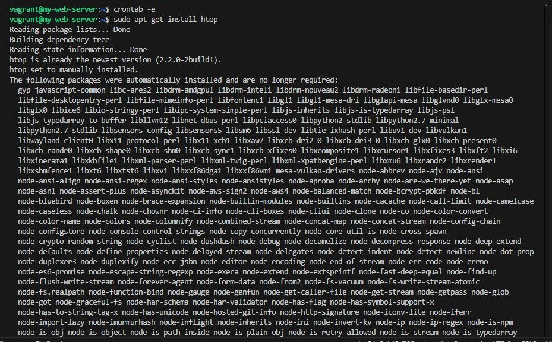
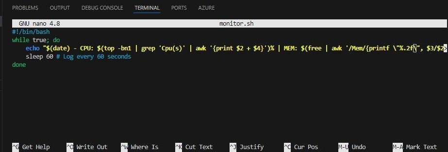
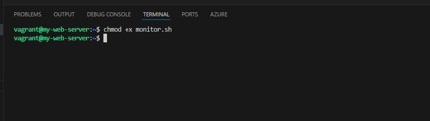

## Linux Lab Guide: Essential Commands in DevOps
### Lab Tasks 1
- Choosing an OS for DevOps Automation
- Objective: Compare the suitability of Linux and Windows for DevOps.

- Research key differences in:
    - Scripting abilities
    - Package management
    - Container compatibility
    - Write a one-page summary on which OS better supports automation and why.

-   Choosing an OS for DevOps Automation: Linux vs. Windows
    -   When selecting an operating system for DevOps automation, the choice often comes down to Linux vs. Windows. Both have strengths, but Linux is generally favored for automation due to its flexibility, open-source nature, and compatibility with DevOps tools.

- Key Differences
1. Scripting Abilities
- Linux: Uses Bash, which is widely adopted in DevOps for automation. It integrates seamlessly with tools like Ansible, Terraform, and Kubernetes.
- Windows: Uses PowerShell, which is powerful for Windows environments but has limited adoption in cloud-native DevOps workflows.

2. Package Management
- Linux: Has robust package managers like APT (Debian-based), YUM/DNF (Red Hat-based), and Pacman (Arch-based), making software installation and updates efficient.
- Windows: Uses Chocolatey and Windows Package Manager (winget), but these are less mature compared to Linux package managers.

3. Container Compatibility
- Linux: Native support for Docker and Kubernetes, making it the preferred OS for containerized applications.
- Windows: Supports Windows Containers, but compatibility is limited compared to Linux.

- Which OS Better Supports Automation?
- Linux is the superior choice for DevOps automation due to its:
    - Strong scripting capabilities with Bash.
    - Efficient package management for software deployment.
    - Seamless container compatibility with Docker and Kubernetes.
    - Open-source flexibility, allowing customization without licensing restrictions.

- While Windows has improved with tools like WSL (Windows Subsystem for Linux), Linux remains the dominant OS for DevOps automation, especially in cloud environments.

### Task 2: Configuring the OS with Bash Scripts
- Objective: Use Bash to automate Linux server tasks.

- Create a Bash script to:
    - Update OS packages
    - Install essential tools (if necessary)
    - Enable firewall

>   
    #!/bin/bash

    # Update OS packages
    sudo apt-get update

    # Install essential tools (if needed)
    sudo apt-get install -y ufw

    # Enable firewall
    sudo ufw enable

    echo "System updated and firewall enabled."
    Save as setup.sh and make it executable:

    chmod +x setup.sh

- Run the script:

>   ./setup.sh

- Schedule the script to run daily using cron:

> crontab -e

- Add the following line to run it at midnight:

>   0 0 * * * /path/to/setup.sh

### Task 3: System Monitoring and Logging
- Objective: Track and log system performance data.
    - Install htop for real-time monitoring:
    
    >   sudo apt-get install htop

- Create a script for logging system metrics:

>
    #!/bin/bash
    while true; do
        echo "$(date) - CPU: $(top -bn1 | grep 'Cpu(s)' | awk '{print $2 + $4}')% | MEM: $(free | awk '/Mem/{printf \"%.2f\", $3/$2 * 100.0}')" >> /var/log/system_metrics.log
        sleep 60 # Log every 60 seconds
    done

>   chmod +x monitor.sh

>   nohup ./monitor.sh &

- View the logs with:

>   cat /var/log/system_metrics.log

