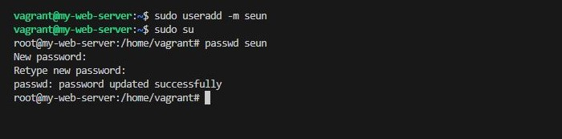

# Critical Thinking Project: Operating System Basics in DevOps Automation and Scaling

- ### Task 1: Choose the Best OS for DevOps Automation
    - Objective: Evaluate the suitability of Linux and Windows for DevOps tasks, focusing on automation ease, scripting capabilities, package management, and container support.

    - Scenario:
        - The company uses both Linux and Windows on various servers. To standardize the environment, you need to select the most suitable OS for a microservices application deployment using basic DevOps automation.

    - Deliverable:
        - Comparison Report: Write a one-page comparison between Linux and Windows for DevOps tasks (scripting, package management, containerization). Conclude with your recommendation on which OS is more suitable for automation in a DevOps environment, with reasons for your choice.

### Comparison Report: Linux vs Windows for DevOps Automation

#### Scripting Capabilities
- **Linux**: Offers robust scripting support through Bash, a default shell that excels in automating tasks and managing environments. It also supports other scripting languages like Python, Perl, and Ruby with ease.
- **Windows**: Primarily relies on PowerShell, which provides a powerful, object-oriented scripting environment. While advanced, it is less prevalent in the DevOps community compared to Bash.

#### Package Management
- **Linux**: Boasts efficient and mature package managers like `apt` (Debian-based systems) and `yum`/`dnf` (Red Hat-based systems). These tools simplify the process of installing, updating, and managing software dependencies.
- **Windows**: Windows offers `winget` as a package manager, but it is newer and less integrated into automation workflows compared to Linux's tried-and-tested options.

#### Containerization Support
- **Linux**: Has seamless compatibility with containerization technologies like Docker and Kubernetes. Most containerized applications are designed to run on Linux due to its lightweight architecture and broad support from the DevOps ecosystem.
- **Windows**: While Docker is supported on Windows, containers typically run on a Linux kernel in compatibility mode. Windows containers are available but are less commonly used in real-world scenarios.

#### Automation Ease
- **Linux**: Known for its stability, customizability, and extensive support for automation tools such as Ansible, Puppet, and Chef. Linux commands and tools are well-suited for scripting and batch processing.
- **Windows**: While automation tools like PowerShell DSC (Desired State Configuration) and support for Ansible exist, Windows systems are generally more complex to automate due to GUI dependencies.

---

### Recommendation
**Linux** is the more suitable choice for DevOps automation. It excels in scripting flexibility, mature package management, and strong container support, which are critical for deploying microservices applications. Its widespread adoption in the DevOps community ensures access to a wealth of resources, tools, and best practices, making it the preferred OS for standardizing and optimizing the company’s DevOps workflows.

### Task 2: Introduction to the Command Line
- Objective: Gain practical experience with basic Linux command-line operations, essential for automation and environment management.

- Scenario: As a beginner managing Linux servers, understanding key commands is crucial. These basics will form the foundation for advanced DevOps automation tasks.

Deliverable: Command-Line Guide: Use a Linux distribution (e.g., Ubuntu) to execute and document the following commands:
- ls: List files and directories
- cd: Navigate directories
- mkdir: Create directories
- cat: View file contents
- rm: Delete files
- Documentation: For each command, note what it does, why it is useful, and provide an example of its application in a DevOps context.

    - ls: List files and directories
        - The `ls` command is incredibly useful in DevOps workflows, as it simplifies many tasks related to file and directory management. Here’s how `ls` contributes to DevOps practices:

            1. File and Directory Verification: Quickly check the existence of critical configuration files, logs, or scripts.
                - Example: Validating the presence of files in deployment directories before executing automation scripts.

            2. Environment Troubleshooting: Diagnose issues by inspecting directories for missing or incorrectly named files.
                - Example: Investigating deployment failures due to misplaced dependencies.

            3. Log Management: Browse log directories and ensure logs are being generated as expected.
                - Example: Using `ls -lh /var/log/` to confirm log sizes and visibility.

            4. Automation and Scripting: Integrate `ls` within scripts to dynamically list files for processing.
                - Example: Automating backups by iterating over files with a certain extension.

            5. Disk Space Monitoring: Combine `ls` with `du` or other commands to investigate large files impacting storage.
                 - Example: Running `ls -lh` to locate oversized files.


 - `cd` command in the context of navigating directories in a terminal or command-line interface. 
    - `cd` stands for "change directory." It's used to switch between folders or directories within a file system.

    ### Basic Usage:
        1. **Navigate to a directory**:
            
            cd folder_name
             
   This moves you into the specified folder.

    2. Go back to the parent directory**:
   
        cd ..
   
        The `..` represents the parent folder.

    3. Go to the root directory:
   
        cd /
   

    4. Navigate to a specific path:
   
        cd /path/to/directory
   

    5. Return to the home directory:
   
        cd ~

- NOTE  `cd -` to return to the previous directory you were in, which is great for quick back-and-forth navigation.


- mkdir: Create directories
- The `mkdir` command in Linux is used to create one or more directories. Here's how it works:

    ### Basic Usage
    - Create a single directory:
  
    >    mkdir directory_name
  

    - Create multiple directories at once:
  
     >   mkdir dir1 dir2 dir3
  

    - Create parent directories (if they don't already exist):
  
    >    mkdir -p parent/child
  
        - This ensures that both `parent` and `child` directories are created in one go, even if `parent` doesn't exist.

    ### Usefulness in DevOps

    - Directory Organization: Automate the setup of directory structures for projects, logs, or deployments.
         - Example: Creating folders for environments (`mkdir prod dev staging`) during CI/CD pipelines.

    - Automation Scripts: Utilize `mkdir` in shell scripts to dynamically prepare directories for builds, tests, or backups.


- cat: View file contents:  The `cat` command in Linux is used to display the contents of a file, and it's quite versatile. Here’s how you can use it:

    ### Basic Usage
    - View a File:
  
    >   cat file_name
  

    - View Multiple Files: Concatenate and display the contents of multiple files:
  
     >   cat file1 file2
  

    - Create a File: You can also use `cat` to create a file by redirecting input:

     >     cat > new_file
  


    - Numbered Output: Show line numbers in the output for easier navigation:
  
     >   cat -n file_name

### Usefulness in DevOps
- **Log Inspection**: Quickly view logs to troubleshoot issues.
- **Configuration Validation**: Check the contents of configuration files to verify settings.
- **Data Pipelines**: Combine file outputs for quick analysis or scripting.


-  rm: Delete files: The `rm` command in Linux is used to delete files and directories. Here are some key usages:

    ### Basic Usage
    - Delete a Single File:
  
     >     rm file_name


    - Delete Multiple Files:
  
     >   rm file1 file2 file3
  

    - Delete a Directory and Its Contents (recursively):
  
     >   rm -r directory_name
  

    - Force Delete Without Confirmation:
  
     >   rm -f file_name
  
       -  Be cautious with this option, as it bypasses prompts.

    - Combine Options (Force and Recursive):
  
     >   rm -rf directory_name
    
    - Use this with care, as it will delete the directory and all its contents without asking for confirmation.


    - Usefulness in DevOps
    - Cleanup Scripts: Automatically remove temporary files, logs, or artifacts during builds or deployments.
    - Resource Management: Delete old backups or unused files to free up space.
    - Error Recovery: Clear faulty or corrupted files during troubleshooting.

### Task 3: Understanding OS Users and Permissions
- Objective: Learn how to manage users and permissions, crucial for securing access in a DevOps setting.

- Scenario: Ensuring proper access control on servers is essential to protect sensitive files and configurations. Understanding how to configure users and permissions is a foundational skill in OS management.

- Deliverable:

- User Management and Permissions Documentation:
- Create a new user on a Linux system.
- Modify file permissions using chmod to control access for specific users.
- Verify file ownership and permissions with ls -l.
- Explanation: Document each step and explain how managing users and permissions can improve security, particularly in a DevOps environment.

- User Management and Permissions Documentation:

    # Linux User Management and Permissions Documentation

    ## 1. Introduction

    - In multi-user systems, proper management of user accounts, groups, and file permissions is paramount. It not only helps maintain security but also streamlines operations in DevOps environments. This documentation covers the basics of managing users and groups and explains how to control file permissions using commands such as `useradd`, `usermod`, `groupadd`, `chmod`, and `chown`.

    ---

    ## 2. User Management

    - User management involves creating, modifying, and deleting user accounts. Here are some key commands and their usage:

    ### 2.1 Creating a New User

    - **Command:** `useradd`
    - **Syntax:**  
    ```bash
    sudo useradd -m [seun]
    ```
    
    - **Description:**  
    - The `-m` option creates a home directory for the new user.
    - Ensure you run this command with superuser privileges using `sudo` or as root.

    - **Example:**  
    ```bash
    sudo useradd -m tolu
    ```
    - This command creates a new user named *tolu* with a home directory at `/home/tolu`.

    ### 2.2 Modifying an Existing User

    - **Command:** `usermod`
    - **Syntax:**  
    ```bash
    sudo usermod [options] [username]
    ```
    - **Common Options:**  
    - `-aG [group]`: Append the user to a group.
    - `-d [directory]`: Change the user's home directory.
    
    - **Example:**  
    ```bash
    sudo usermod -aG docker seun
    ```
    This command adds the user 'seun' to the *docker* group.

    ### 2.3 Deleting a User

    - **Command:** `userdel`
    - **Syntax:**  
    ```bash
    sudo userdel [options] [username]
    ```
    - **Common Option:**  
    - `-r`: Remove the home directory along with the user account.
    
    - **Example:**  
    ```bash
    sudo userdel -r seun
    ```
    This command deletes the user *seun* and their home directory.

    ---

    ## 3. Group Management

    Groups allow administrators to manage permissions for multiple users simultaneously.

    ### 3.1 Creating a New Group

    - **Command:** `groupadd`
    - **Syntax:**  
    ```bash
    sudo groupadd [groupname]
    ```
    - **Example:**  
    ```bash
    sudo groupadd devops
    ```
    This creates a new group named *devops*.

    ### 3.2 Modifying Group Membership

    - **Command:** `usermod` (to add a user to a group)
    - **Syntax:**  
    ```bash
    sudo usermod -aG [groupname] [username]
    ```
    - **Example:**  
    ```bash
    sudo usermod -aG devops seun
    ```
    This appends the user *seun* to the *devops* group.

    ### 3.3 Deleting a Group

    - **Command:** `groupdel`
    - **Syntax:**  
    ```bash
    sudo groupdel [groupname]
    ```
    - **Example:**  
    ```bash
    sudo groupdel devops
    ```
    This command deletes the *devops* group.

    ---

    ## 4. File and Directory Permissions

    File permissions control which users can read, write, or execute a file. Permissions are divided into three categories: owner, group, and others.

    ### 4.1 Understanding Permission Notation

    - **Symbolic Representation:**  
    A typical permission string looks like this:  
    `-rwxr-xr--`  
    - **Owner:** `rwx` (read, write, execute)
    - **Group:** `r-x` (read, execute)
    - **Others:** `r--` (read only)

    - **Octal Notation:**  
    Each permission is also represented using numbers:
    - Read (r) = 4
    - Write (w) = 2
    - Execute (x) = 1

    For example, `755` represents:
    - Owner: 7 (rwx = 4+2+1)
    - Group: 5 (r-x = 4+0+1)
    - Others: 5 (r-x = 4+0+1)

    ### 4.2 Changing File Permissions with `chmod`

    - **Command:** `chmod`
    - **Syntax:**  
    ```bash
    chmod [options] [permissions] filename
    ```
    - **Examples:**

    - **Using Octal Notation:**  
        ```bash
        chmod 644 file.txt
        ```
        This grants the owner read and write permissions, while the group and others get read-only permissions.

    - **Using Symbolic Notation:**  
        ```bash
        chmod u+x,g+rx,o+r file.txt
        ```
        This adds execute permission for the owner, read and execute for the group, and read-only for others.

    - **Recursive Permission Change:**  
        ```bash
        chmod -R 755 /var/www/html
        ```
        Applies permissions recursively to all files and directories within `/var/www/html`.

    ### 4.3 Changing Ownership with `chown` and `chgrp`

    - **Command:** `chown`
    - **Syntax:**  
    ```bash
    sudo chown [user]:[group] filename
    ```
    - **Example:**  
    ```bash
    sudo chown tolu:devops file.txt
    ```
    This changes the owner of *file.txt* to *seun* and its group to *devops*.

    - **Command:** `chgrp`
    - **Syntax:**  
    ```bash
    sudo chgrp [group] filename
    ```
    - **Example:**  
    ```bash
    sudo chgrp devops file.txt
    ```
    This changes the group of *file.txt* to *devops*.


- Modify file permissions using chmod to control access for specific users.
    - The `chmod` command in Linux is used to modify file permissions to control access for users. Here’s a guide to using it effectively:

    ### File Permission Basics
    Each file and directory has three types of permissions:
    1. **Read (`r`)**: Allows viewing the contents.
    2. **Write (`w`)**: Allows editing or deleting.
    3. **Execute (`x`)**: Allows running a file as a program.

    Permissions are assigned to three categories of users:
    - **Owner**: The user who owns the file.
    - **Group**: Users in the file's group.
    - **Others**: All other users.

    ### Syntax
    ```bash
    chmod [options] [permissions] file_name
    ```

    ### Examples
    1. **Set Specific Permissions Using Symbols**:
    - Grant read and write permissions to the owner, and read-only permissions to the group and others:
        ```bash
        chmod u+rw,g+r,o+r file_name
        ```

    2. **Use Octal Notation**:
    Permissions can be represented as octal numbers (e.g., `777`, `644`, etc.).
    - Example: Set permissions for a file as:
        ```bash
        chmod 644 file_name
        ```
        Here:
        - `6` (Owner): Read + Write
        - `4` (Group): Read-only
        - `4` (Others): Read-only

    3. **Make a File Executable**:
    - Add execute permission for the owner:
        ```bash
        chmod u+x file_name
        ```

    4. **Recursive Permission Change**:
    - Change permissions for all files within a directory:
        ```bash
        chmod -R 755 directory_name
        ```

    ### Helpful Tips
    Run `ls -l` to view current permissions before modifying them. It will display a string like `-rw-r--r--`, which represents:
    - Owner (`rw`): Read + Write
    - Group (`r`): Read-only
    - Others (`r`): Read-only.


- Managing users and permissions is essential for strengthening security, and its importance is amplified in a DevOps environment where automation and rapid deployments play a crucial role. Here’s how effective user and permissions management translates into improved security:

---

### 1. Enforcing the Principle of Least Privilege

- **Least privilege** means that users and processes have only the minimum access necessary to perform their tasks. By rigorously managing which users have access to which files, services, and systems, you can significantly reduce the attack surface. For instance, if a developer account that only needs access to source code accidentally gains access to production systems, a breach could have catastrophic consequences. Properly managed permission settings ensure that even if a user’s credentials are compromised, the damage is contained to a limited area.

---

### 2. Reducing the Impact of Human Error

- In a dynamic DevOps environment, change is constant. With a clearly defined user and permissions model, there’s less risk of accidental misconfigurations or unauthorized changes. For example, automated scripts or deployment pipelines that run under specific, non-privileged service accounts prevent inadvertent system-wide changes that a superuser might otherwise cause. This containment helps maintain system integrity and minimizes unintentional security lapses.

---

### 3. Streamlining Auditing and Accountability

- When every action is attached to a distinct user and proper permissions are enforced, it becomes significantly easier to track changes, audit activities, and identify potential security breaches. In DevOps, where infrastructure changes can be frequent and automated, meticulous logging associated with user actions helps maintain accountability. Audit trails can reveal unusual access patterns or privilege escalations, allowing for faster incident response and more precise forensic investigations.

---

### 4. Enhancing Containerization and Automation Security

- Modern DevOps practices rely on containerization and microservices, often orchestrated by platforms like Kubernetes. Containers run under specific user contexts, and their interactions can be tightly controlled through permissions. By managing user accounts and their associated capabilities, DevOps teams can ensure that containerized applications operate with only the necessary privileges. This reduces the risk of lateral movement if one container is compromised.

---

### 5. Facilitating Role-Based Access Control (RBAC)

- Using RBAC, you assign permissions based on a user's role rather than on an individual basis. In a DevOps ecosystem, this methodology can simplify management dramatically by ensuring that each role—be it developer, tester, or operations engineer—has a predefined set of permissions tailored to their specific tasks. This structured approach helps in quickly aligning access rights with organizational changes without jeopardizing security.

