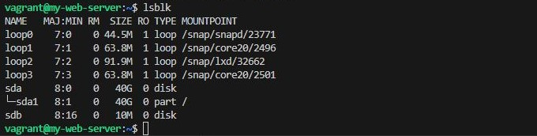
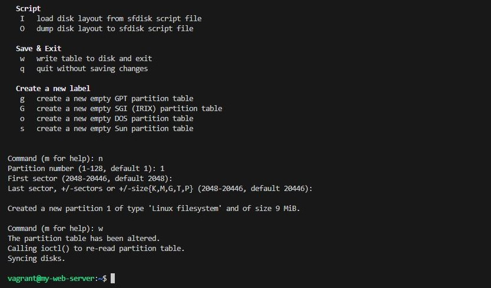
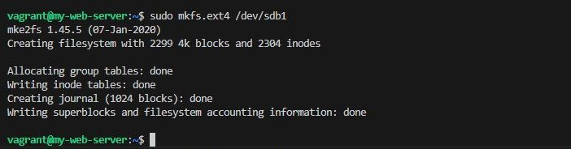
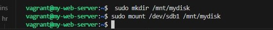
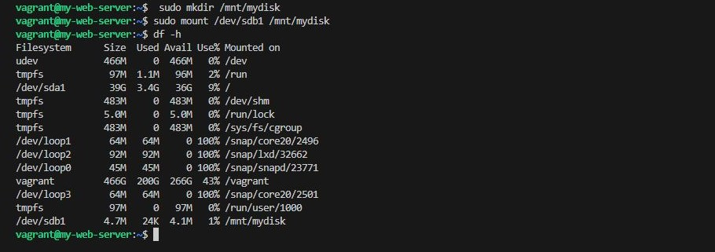
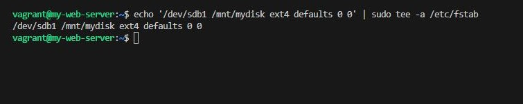

## Disk Management and Mounting

### Objective
- Learn how to manage disks, create partitions, and mount filesystems in Linux.

### Steps

-   List Disks: List all disks and partitions.

>   lsblk

- Create a Partition: Use fdisk to create a new partition on an available disk (e.g., /dev/sdb).

>   sudo fdisk /dev/sdb

- Format the Partition: Format the new partition with the ext4 filesystem.

>   sudo mkfs.ext4 /dev/sdb1

- Mount the Partition: Create a mount point and mount the partition.

>
    sudo mkdir /mnt/mydisk
    sudo mount /dev/sdb1 /mnt/mydisk

- Verify the Mount: Check if the partition is mounted.

>   df -h

- Add to /etc/fstab
- Add the partition to /etc/fstab for automatic mounting at boot.

> echo '/dev/sdb1 /mnt/mydisk ext4 defaults 0 0' | sudo tee -a /etc/fstab

