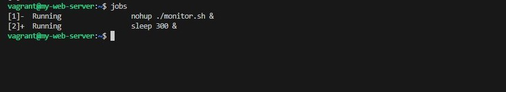
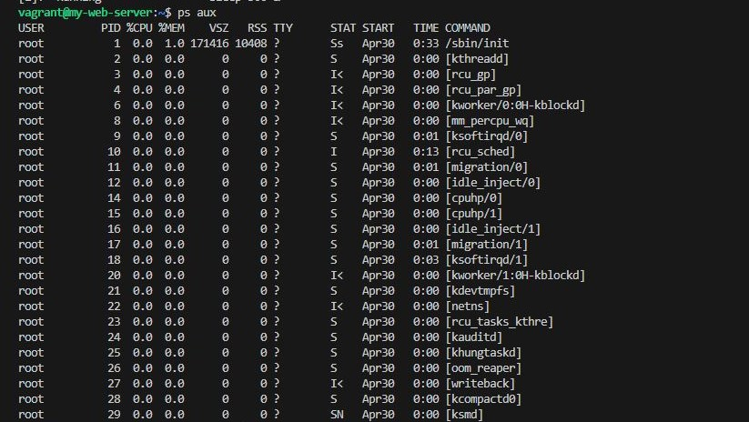
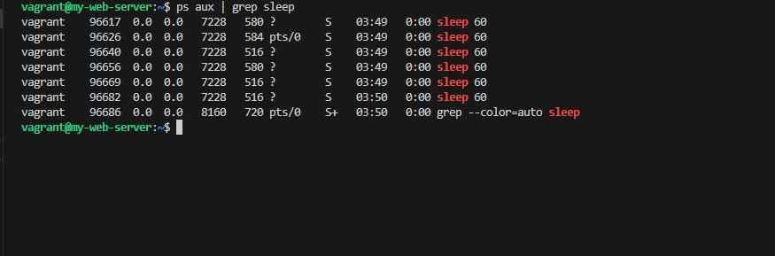
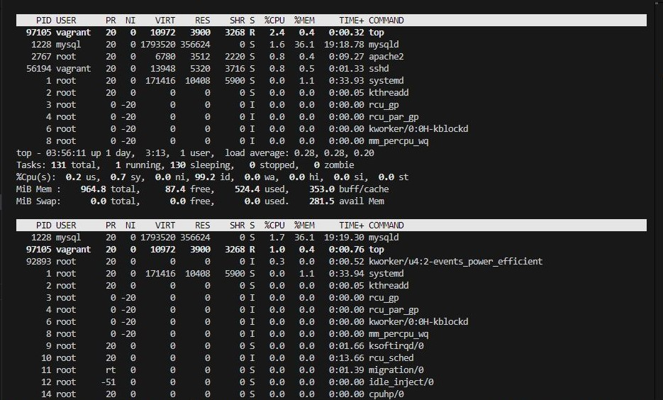

## Process Management

### Objective
- Learn how to manage processes in Linux, including starting, stopping, and monitoring processes.

### Steps
- Start a Background Process: Start a long-running process in the background (e.g., sleep).

>   sleep 300 &

- List Running Processes: List all running processes.

>   ps aux

- Kill a Process: Find the process ID (PID) of the sleep process and kill it.

>   ps aux | grep sleep

- Monitor System Resources: Use top to monitor system resources.

> top

- Change Process Priority: Start a new sleep process and change its priority using nice and renice.

> nice -n 10 sleep 300 &

