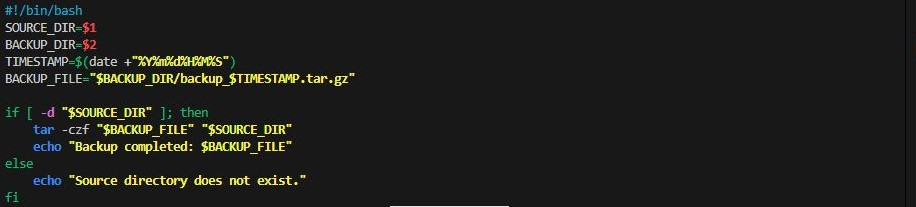
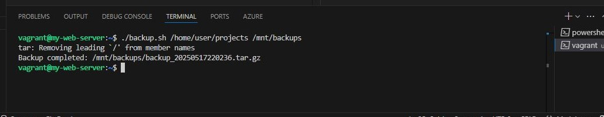
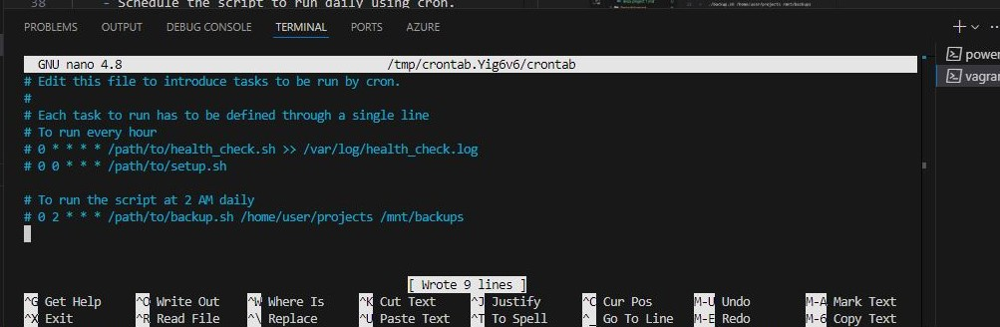
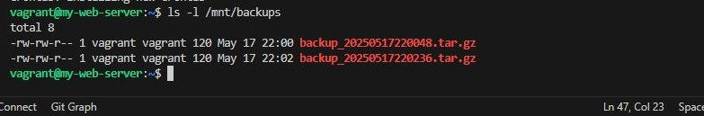

## Shell Scripting

### Objective
- Write a shell script to automate a common administrative task.

### Steps
- Create a Backup Script

>
    #!/bin/bash
    SOURCE_DIR=$1
    BACKUP_DIR=$2
    TIMESTAMP=$(date +"%Y%m%d%H%M%S")
    BACKUP_FILE="$BACKUP_DIR/backup_$TIMESTAMP.tar.gz"

    if [ -d "$SOURCE_DIR" ]; then
        tar -czf "$BACKUP_FILE" "$SOURCE_DIR"
        echo "Backup completed: $BACKUP_FILE"
    else
        echo "Source directory does not exist."
    fi

- Make the Script Executable: Make the script executable.

>   chmod +x backup.sh

- Run the Script
    - Run the script to back up a directory.

>   ./backup.sh /home/user/projects /mnt/backups

- Schedule the Script with Cron
    - Schedule the script to run daily using cron.

>   crontab -e

- Verify the Backup
    - Check the backup directory to ensure the backups are created.

>   ls -l /mnt/backups

