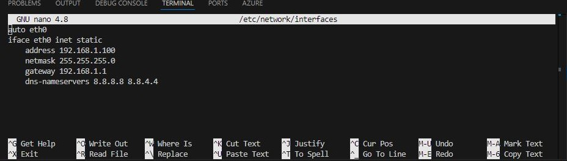
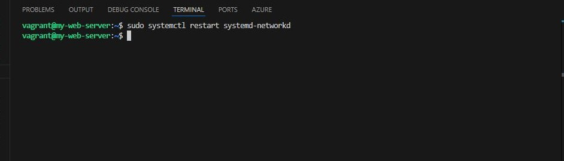
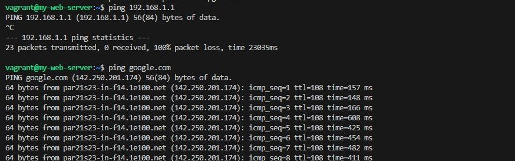
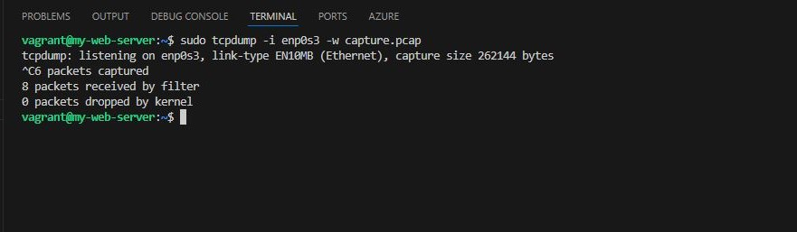
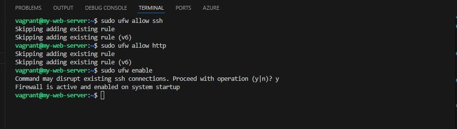
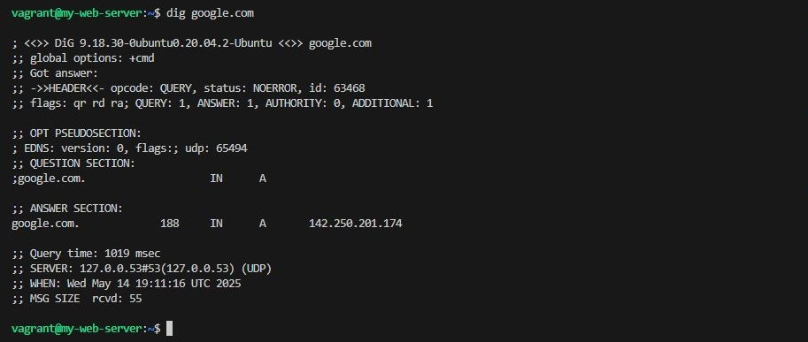

## Project 1: Network Configuration and Troubleshooting
### Objective
- Learn how to configure and troubleshoot network settings in Linux.

- Steps
- Set a Static IP Address:
    - Edit the network configuration file to set a static IP address.

>   sudo nano /etc/network/interfaces

-  Add the following lines (adjust for your network):

>
        auto eth0
        iface eth0 inet static
            address 192.168.1.100
            netmask 255.255.255.0
            gateway 192.168.1.1
            dns-nameservers 8.8.8.8 8.8.4.4

- Restart the networking service.

>   sudo systemctl restart systemd-networkd

- Test Network Connectivity:
    - Use ping to test connectivity to the gateway and an external site (e.g., Google).
>
        ping 192.168.1.1
        ping google.com

- Capture Network Traffic:
    - Use tcpdump to capture network traffic on the eth0 interface.
        >   sudo tcpdump -i eth0 -w capture.pcap
        

- Analyze the captured traffic using tcpdump or Wireshark.
      
   >    tcpdump -r capture.pcap

- [screenshot-5](analyzecapturedtraffik.JPG)

- Set Up a Firewall:
    - Use ufw (Uncomplicated Firewall) to allow SSH and HTTP traffic.
    
    > 
        sudo ufw allow ssh
        sudo ufw allow http
        sudo ufw enable

- Troubleshoot DNS:
    - Use dig to troubleshoot DNS resolution.

        >   dig google.com

