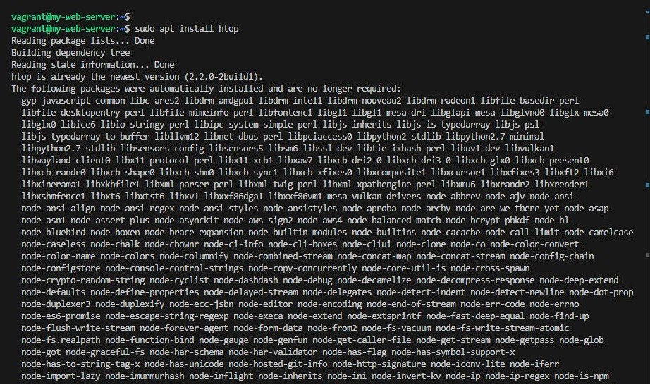
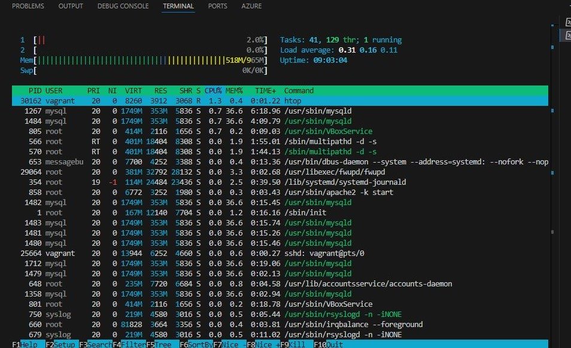
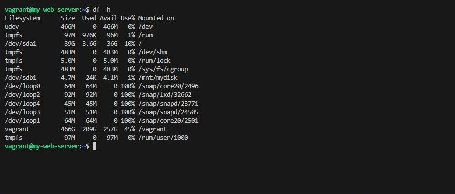
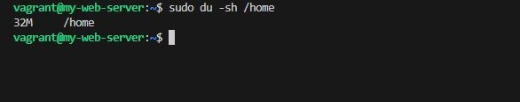
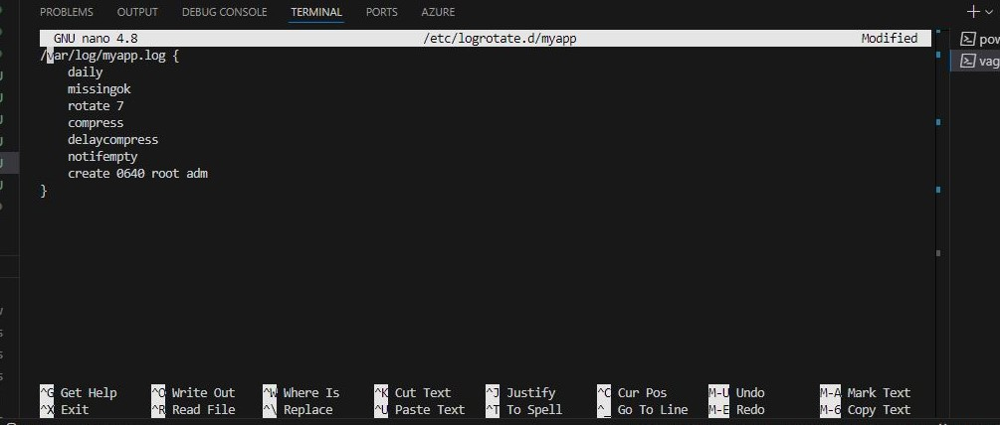

## System Monitoring and Log Management
### Objective 
- Learn how to monitor system performance and manage logs in Linux.

- Steps
    - Monitor System Performance
        - Use <code>htop</code> to monitor CPU, memory, and process usage

>
    sudo apt install htop

- Check Disk Usage
    - Use <code>df</code> and <code>du</code> to check disk usage.

>
    df -h
    du -sh /home

- Set Up Log Rotation
    - Configure log rotation for a custom log file (e.g., /var/log/myapp.log).

>   sudo nano /etc/logrotate.d/myapp

- Analyze Logs
    - Use grep to search for specific entries in system logs.

> grep "error" /var/log/syslog

- Set Up Alerts
    - Use cron and mail to send alerts when disk usage exceeds 90%.

> sudo crontab -e

- Add the following line:

>

    */10 * * * * df -h | awk '$5 > 90 {print $1, $5}' | mail -s "Disk Usage Alert" akindulureniseun@gmail.com

