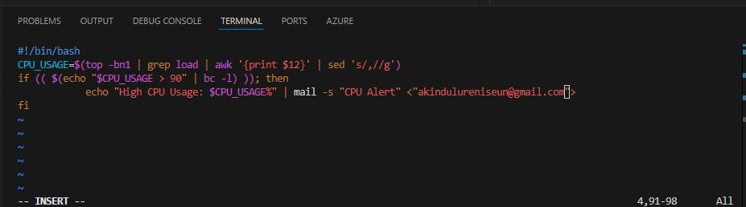

## Advanced Shell Scripting
### Objective
- Write an advanced shell script to automate system administration tasks.

    - Steps
        - Create a System Health Check Script
            - Write a script to check CPU usage, memory usage, disk usage, and running processes.
>    
        #!/bin/bash
        echo "CPU Usage: $(top -bn1 | grep load | awk '{print $12}')"
        echo "Memory Usage: $(free -m | awk '/Mem:/ {print $3 " MB used"}')"
        echo "Disk Usage: $(df -h / | awk '/\// {print $5 " used"}')"
        echo "Top 5 Processes:"
        ps -eo pid,ppid,cmd,%mem,%cpu --sort=-%cpu | head -n 6            

- Make the Script Executable

>   chmod +x health_check.sh

-   Run the Script
    - Run the script to check system health.

>       ./health_check.sh

- Schedule the Script with Cron
    - Schedule the script to run every hour using cron.

>           crontab -e

- Add the following line:
>
    0 * * * * /path/to/health_check.sh >> /var/log/health_check.log

- Add Email Notifications
    - Modify the script to send an email if CPU usage exceeds 90%.

>
        #!/bin/bash
    CPU_USAGE=$(top -bn1 | grep load | awk '{print $12}' | sed 's/,//g')
    if (( $(echo "$CPU_USAGE > 90" | bc -l) )); then
        echo "High CPU Usage: $CPU_USAGE%" | mail -s "CPU Alert" <"put-your-email-here">
    fi

