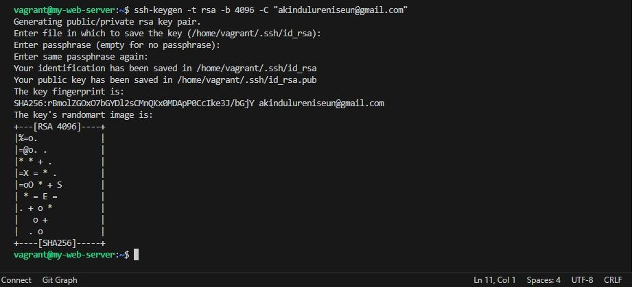
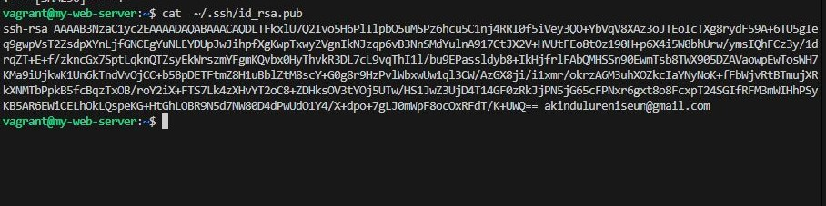
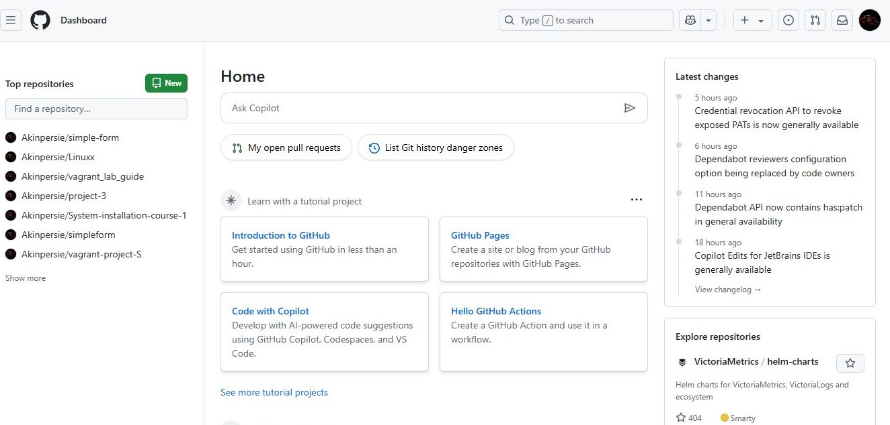
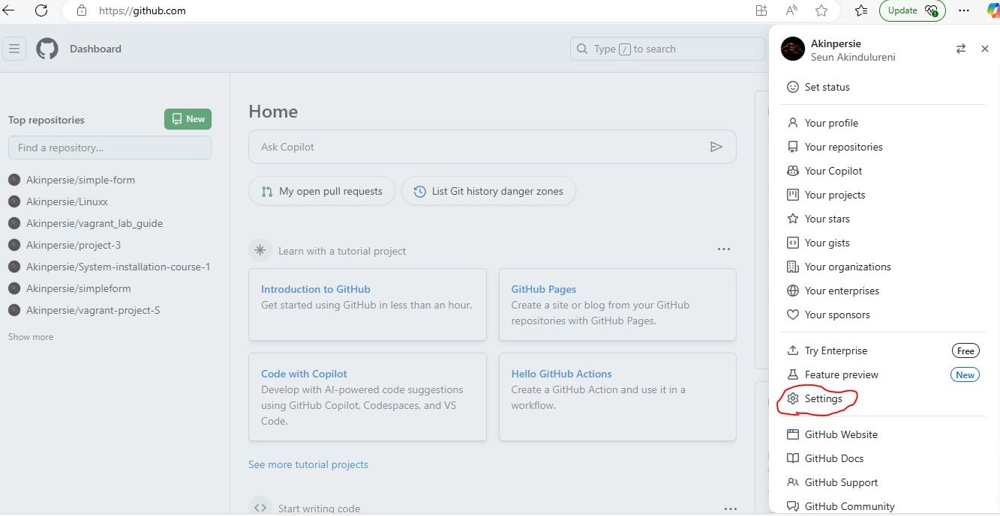
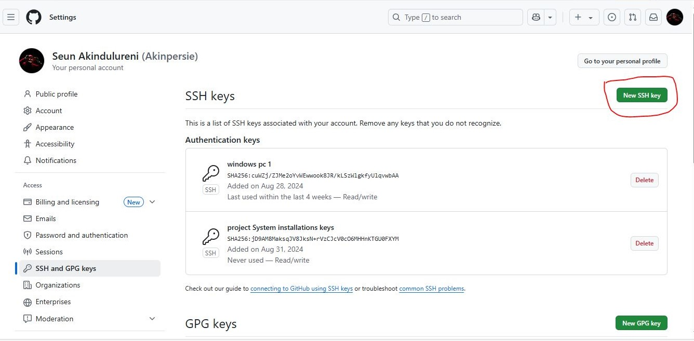
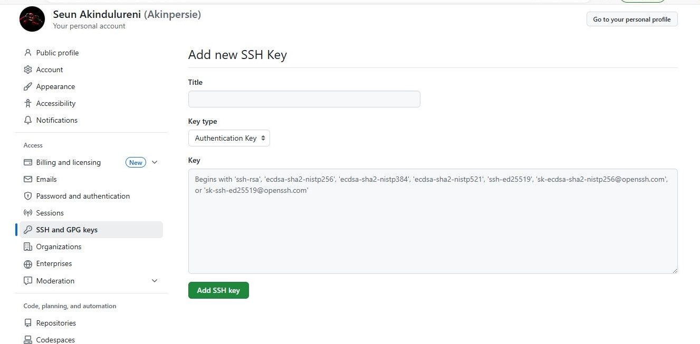
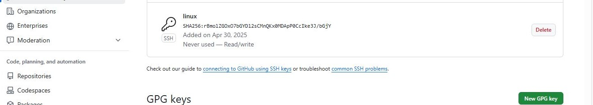

## SSH Agent Lab Guide
### Objective
- Learn how to manage SSH keys using SSH Agent, allowing you to securely access remote systems without repeatedly entering your passphrase.

- Step 1: Generate an SSH Key Pair
- If you don't already have an SSH key pair, you need to create one.

>   Command:
    <code> ssh-keygen -t rsa -b 4096 -C "your_email@example.com" </code>

- Expected Output:
    - You will see a prompt to enter the file in which to save the key. You can press Enter to accept the default location (~/.ssh/id_rsa).

- Generating public/private rsa key pair.
    - Enter file in which to save the key (/home/user/.ssh/id_rsa): You will then be prompted to enter a passphrase (optional) or just press <mark>Enter</mark> without typing anything.

- Example Output:
          
    - Expected Output: You will see a prompt to enter the file in which to save the key. You can press Enter to accept the default location (~/.ssh/id_rsa).

    - Generating public/private rsa key pair.
    Enter file in which to save the key (/home/user/.ssh/id_rsa): You will then be prompted to enter a passphrase (optional) or just press <mark>Enter</mark> without typing anything.

    - Example Output:
    Enter passphrase (empty for no passphrase):
    Enter same passphrase again: Your identification has been saved in /home/user/.ssh/id_rsa
    
       - Your public key has been saved in /home/user/.ssh/id_rsa.pub
     
- The key fingerprint is:
>      
    SHA256:... your_email@example.com
    The key's randomart image is:
    +---[RSA 4096]----+
    |                 |
    |                 |
    |                 |
    |          . .    |
    |        S o. .   |
    |       o O .+ o  |
    |      . * = = +  |
    |     E + O . o   |
    |      .+O=..     |
    +----[SHA256]-----+

### Step 2: Copy Your Public Key to the Remote Server
- You need to copy your public SSH key to the remote server (Git) to enable passwordless SSH access.
- Use this Command and copy:
>   cat  ~/.ssh/id_rsa.pub

### Step 3: Log Into the Remote Server(Github) and add the public key
- Log into GitHub.
- Click your profile picture in the top right-hand corner of the screen.

- A dropdown menu will appear, as shown in the picture below
- In the menu, click "Settings" to access your account settings.

- Scroll down and click on "SSH and GPG keys."
- Click "New SSH key" on the right. A new page will open.NEwSsh

- Add a title of your choice (it’s recommended to name it after the system you're connecting to).
- Paste the public key you copied.
- Click the "Add SSH key" button below.

